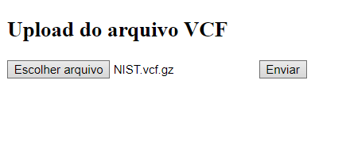

# Variant Calling API

A Variant Calling API é uma web API que permite o upload de arquivos `.vcf.gz` para processamento em um pipeline de bioinformática, utilizando o Snakemake e o ANNOVAR para a anotação de variantes. A API usa a referência **hg19** e carrega automaticamente as bases de dados **"gnomad211_exome"** e **"avsnp138"** para a anotação de variantes ao inicializar. É recomendado usar a API em um ambiente Linux. Desenvolvido em Flask, este projeto automatiza o pipeline de anotação e processamento.

**Nota:** Este projeto utiliza o ANNOVAR para a anotação de variantes. Embora o ANNOVAR seja instalado automaticamente pelo pipeline para este projeto, ele é uma ferramenta de terceiros com restrições de distribuição. Portanto, para usá-lo, é necessário obter a licença adequada para seu ambiente de produção. Mais informações sobre licenciamento estão disponíveis no site oficial: [ANNOVAR](https://annovar.openbioinformatics.org/).

## Índice
- [Pré-requisitos](#pré-requisitos)
- [Instalação](#instalação)
- [Configuração](#configuração)
- [Execução](#execução)
- [Uso](#uso)


## Pré-requisitos

- Python 3.10+
- Docker (opcional, caso deseje usar containers)
- Bibliotecas do Python:
  - Flask
  - Snakemake
  - Outras listadas em `requirements.txt`

## Instalação

1. Clone o repositório:

   ```bash
   git clone https://github.com/seu-usuario/variant_calling_API.git
   cd variant_calling_API
2. Crie um ambiente virtual (opcional, mas recomendado):

    ```bash
    python3 -m venv venv
    source venv/bin/activate  # Linux ou macOS    
    ```
3. Instale as dependências:

    ```bash
    pip install -r requirements.txt
    ```
## Configuração
Nenhum diretório precisa ser criado manualmente, pois a própria API se encarrega de configurar os diretórios necessários automaticamente durante o processo.

## Execução
Para iniciar a aplicação Flask localmente, use o comando:
    ```bash
    flask run
    ```

## Execute em um container Docker:
1. **Construa a imagem Docker:**

    ```bash
    docker build -t variant_calling_api .
    ```

2. **Inicie o container:**

    ```bash
    docker run -p 5000:5000 variant_calling_api
    ```

A API estará acessível em [http://localhost:5000](http://localhost:5000) através de uma interface gráfica:



## Uso
- Upload de Arquivo .vcf.gz
- Endpoint: /
- Método: POST
- Parâmetro: Envie um arquivo .vcf.gz com o campo file.

Exemplo de uso com curl:

  ```bash
  curl -F "file=@path/to/your/file.vcf.gz" http://localhost:5000/upload-vcf-gz
  ```

## Download dos Resultados
Após o processamento do arquivo `.vcf.gz`, o endpoint irá retornar um arquivo `results.zip` contendo os arquivos processados em formato `.txt` e `.vcf`.
